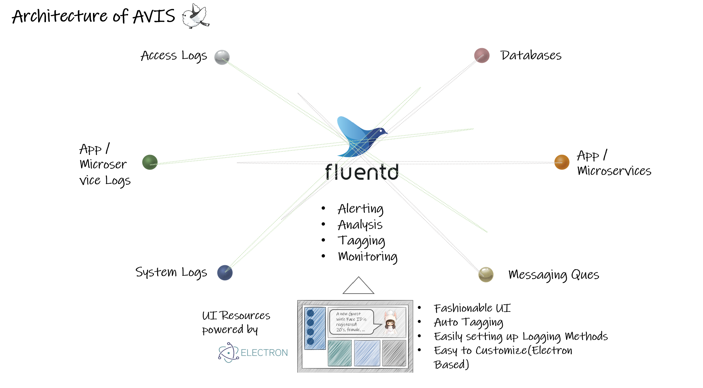

  

 
 Monitors, Pecks and Visualizes Valuated Data from Tons of Floating Logs

*** 

# avis

Avisは、Fluentdを用いてマイクロサービスログやアクセスログ、システムログ等を収集し、収集されたログから重要なログをピックアップしてUI上に表示します。  
UI は Electron をベースとしており、カスタマイズが容易で、直感的で洗練されたUIとなっています。 

## Avisのアーキテクチャ  

## AvisのUIフロントエンド
AvisのUIフロントエンドは、Electronで構築されています。  
詳細は、[avis-electron](https://github.com/latonaio/avis-electron)を参照ください。  